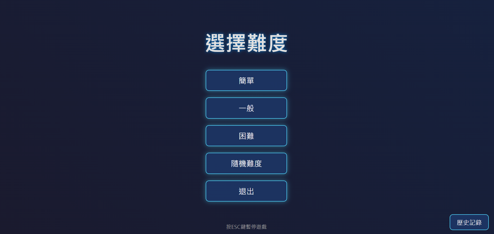
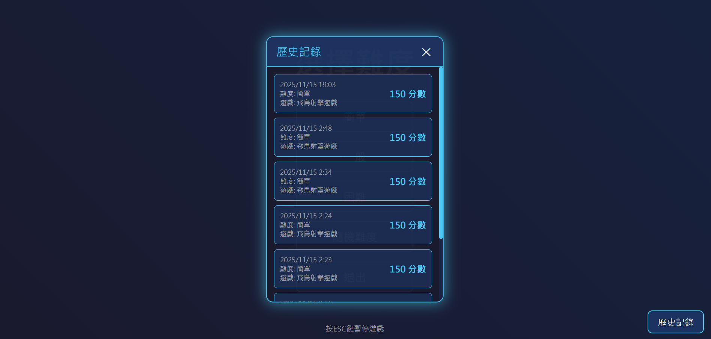
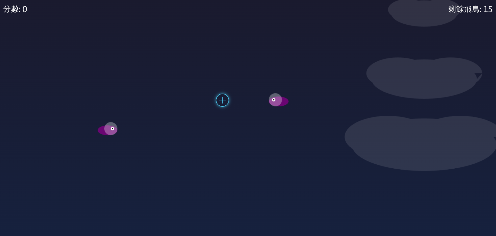
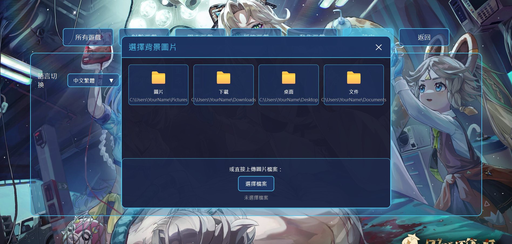
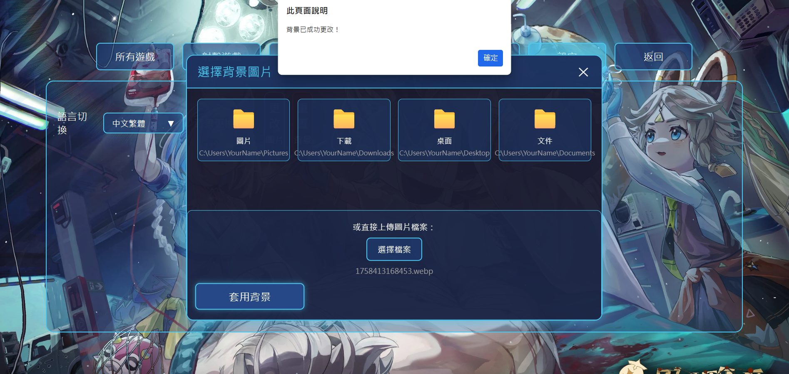

## Click [here to open the simulator](https://41423117.github.io/Eternal-Realm-Games/)

### 第 1 頁


### 第 2 頁  


### 第 3 頁


### 第 4 頁  


### 第 5 頁


### 第 6 頁  


### 第 7 頁


### 第 8 頁


### 第 9 頁


### 第 10 頁  


### 第 11 頁  


# w1

# w9_11/6_12:41 Successfully launched
I have created a game at this stage. The background of the game's main start screen is as shown in the 2k image, and a text button that says "Start" is generated in the lower middle section of the horizontal screen.

When the spacebar is pressed or the mouse clicks the start button, the scene gradually transitions to another screen. The background of this screen is generated as per image 1753283162418.

In the middle of this screen, five flat rectangular slots are generated from top to bottom. The text in the first slot from the top is "Simple," the text in the second slot is "Normal," the text in the fourth slot is "Random Difficulty," and the text in the fifth slot is "Exit."

When the first slot is pressed, the game starts. Birds are generated one by one on either the far left or far right side of the top half of the screen. The generation time is random, between 1 to 2.5 seconds, and all birds fly toward the opposite side. When a bird touches its respective opposite side, it disappears. This level only generates 15 birds, and the speed of the birds at the start of the game is not too fast.

When the second slot is pressed, the game starts. The number of birds generated and their movement speed are increased by 5 birds and 0.3 seconds faster, respectively, compared to the first slot.

When the third slot is pressed, the game starts. The number of birds generated and their movement speed are increased by 10 birds and 0.5 seconds faster, respectively, compared to the second slot.

When the fourth slot is pressed, the game starts. The number of birds generated and their movement speed vary randomly between the values of the first, second, and third slots.

In these four levels of the game, my mouse cursor becomes a shooting circle. When the circle clicks on a bird, the bird is killed and disappears. The clickable range of my circle is 1.5 times its size. The level ends when all birds have completely disappeared.

When the ESC key on the keyboard is pressed, the game pauses, and the screen with the five slots appears. Additionally, a new slot is generated below the fifth slot, with the text "Continue" inside it.

When the "Continue" slot is pressed, the game returns to the paused screen and resumes the unfinished level until the game ends. If the "Exit" slot is pressed, the scene transitions back to the main start screen of the game.

To enter the game again, simply press the "Start" button once more.

When a level is completed, the five slots reappear. If "Exit" is pressed at this point, the scene transitions back to the main start screen of the game. To enter the game again, simply press the "Start" button once more.

  
# w10_11/13_00:19 New feature added: After completing each level, the game now returns to the difficulty selection screen. Additionally, I have improved the issue where the remaining bird count did not update when birds flew to the end.

## Key Update Notes


### Added an escaped bird counter:

Added a birdsEscaped variable to track the number of birds that have flown off the screen.

Improved the bird disappearance logic.

In the updateBirds() function, a check is now performed to determine whether a bird has completely flown off the screen.
  
### When a bird flies out from the left side, check bird.x.
```
bird.x > gameCanvas.width + birdWidth/2。
```
### When a bird flies out from the right side, check bird.x.
```
bird.x < -birdWidth/2。
```

Birds that fly off the screen will be removed from the array, and the birdsEscaped count will be incremented.

### The method for calculating remaining birds has been updated:

The [updateBirdsLeft()] function has been modified. The calculation is now as follows:

Remaining birds = Total birds - Birds killed - Birds escaped.

This accurately reflects the number of birds that still need to be dealt with.

### 改進了飛鳥生成邏輯：

  在生成飛鳥時記錄了飛鳥的方向 (fromLeft)。

  記錄包含：日期時間、難度、分數。

  最新記錄顯示在最上方，舊記錄向下排列。


### 數據持久化：

  使用 localStorage 保存歷史記錄。

  即使關閉瀏覽器或刷新頁面，記錄仍然存在。

  最多保存 50 條最近的記錄。


### 歷史記錄顯示：

  每條記錄顯示日期、難度和分數。

  如果沒有歷史記錄，會顯示"暫無遊戲記錄"。


# 11/15_02:53 我修改遊戲標題成【永恆領域國度】，還新增多種遊戲選項和語言設定:


## 新增功能


### 游戏选择界面：

点击"开始游戏"后显示新的游戏选择界面。

顶部有六个分类标签：所有游戏、射击游戏、开车游戏、纸牌游戏、动作游戏、设定。

默认显示"所有游戏"分类。

内容区域显示相应分类的游戏。

### 游戏显示：

在"所有游戏"和"射击游戏"分类中显示"飞鸟射击游戏"。

点击"飞鸟射击游戏"后进入难度选择界面。

其他分类没有游戏时显示"暂无游戏"。

### 语言切换功能：

在"设定"分类中显示语言切换选项。

语言选择器默认显示"中文繁體"。

点击后展开语言列表，包含多种语言选项。

选择语言后，整个页面的文字会切换到对应语言。

语言选择器中的语言名称始终保持为中文。

### 多语言支持：

实现了中文繁体、中文简体和英文的完整翻译。

可以轻松扩展其他语言。

这个实现保留了原有的飞鸟射击游戏的所有功能，同时添加了游戏选择界面和语言切换功能。界面设计保持了原有的风格，确保用户体验的一致性。


# w13 12/06_04:00 更新功能


## 新增功能：


### 背景更換功能：

在設定頁面中，語言切換下方新增了「背景更換」選項。

右邊有「更改圖片」按鈕，點擊後會開啟模擬的檔案總管視窗。

### 檔案總管模擬：

設計了類似Windows檔案總管的介面。

顯示常見的資料夾（圖片、下載、桌面、文件）。

提供直接上傳圖片的功能。

### 圖片處理與保存：

使用 FileReader API 讀取圖片檔案。

將圖片以 Base64 格式保存到 localStorage。

使用CSS變數(--custom-background)套用背景圖片。

### 持久化儲存：

使用 localStorage 保存背景圖片。

遊戲關閉或頁面重新整理後，背景圖片依然保留。

圖片保持清晰度。

### 背景套用範圍：

套用到「開始遊戲」主畫面。

套用到「開始遊戲後的選項」畫面。

保留原有的科技感光點和機器手效果。

### 重置功能：

新增「重置背景」按鈕。

可以恢復為預設的背景樣式。

### 多語言支援：

背景更換功能支援多語言顯示。

與原有的語言系統整合。

這樣使用者就可以自由更換遊戲的背景圖片，並且更換後的背景會永久保存，直到使用者手動重置。


# w14_12/14_15:20 修改說明:

## 1. CSS部分（第135-275行）：完全替換了機器手臂的樣式，改為鎧甲風格，包括：  

更深的金屬色調和明顯的邊框。

5根分明突出的手指（大拇指、食指、中指、無名指、小拇指）。

手指關節細節和更長的設計。

鎧甲板塊和螺栓/鉚釘裝飾。

增強的光效和陰影。

## 2. HTML部分（第519-547行）：替換了左右兩隻機器手的結構：  

增加了更多手指結構（5根手指）。

添加了鎧甲板塊和螺栓裝飾。

每根手指都有關節細節。

### 現在機器手臂會顯示為像鎧甲一樣的機械手，手指更加分明突出，整體更有立體感和機械感。


# w15_12/17_02:20 主要新增功能 

## 1. 背景更換系統 

新增「設定」選項卡，內含背景更換功能。

添加了「檔案總管模擬視窗」介面。

支援上傳自訂圖片作為遊戲背景。

新增「重置背景」按鈕（正方形按鈕設計）。

## 2. 語言切換功能 

在設定中新增完整的語言切換系統。

支援繁體中文、簡體中文、英文三種語言。

動態更新所有介面文字。

## 3. 增強型射擊遊戲功能 

### 新增炸彈元素：隨機出現的炸彈，點擊會扣分 

### 隨機難度模式改進：

改為 40 秒限時模式。

炸彈有不同大小（1x、1.5x、2x）對應不同扣分。

更隨機的飛鳥生成時間。

### 新增扣分動畫效果：點擊炸彈時顯示紅色扣分數字 

## 4. 改進的使用者介面

正方形按鈕設計：背景更換按鈕改為正方形樣式。

分類標籤重新設計：新增「設定」和「所有遊戲」分類。

科技感光點增強：動態創建更多光點效果。

## 12/17_03:20 主要修改內容：

### 1.刪除了不必要的投籃遊戲程式：只保留了原有的飛鳥射擊遊戲。
 
### 2.整合了生存射擊遊戲：

將[新遊戲]檔的生存射擊遊戲完整整合到[原本]檔中。

新增了生存射擊遊戲的所有畫面、HUD、遊戲邏輯和繪製功能。

新增了生存射擊遊戲專用的CSS樣式。

#### 3.新增了"survive"遊戲格子：

在games物件中新增了survive遊戲，屬於"shooting"類別。

在"所有遊戲"和"射擊遊戲"分類下都會顯示"生存射擊遊戲"格子。

#### 4.點擊"survive"格子的功能：

當用戶點擊"生存射擊遊戲"格子時，會切換到生存射擊遊戲的開始畫面。

生存射擊遊戲有完整的開始/退出按鈕，與[2.1]檔的設計一致。

可以從生存射擊遊戲返回主選單或遊戲選擇界面。

#### 5.遊戲狀態管理：

新增了SURVIVAL_GAME遊戲狀態。

確保兩個遊戲之間的切換順暢，不會互相干擾。
